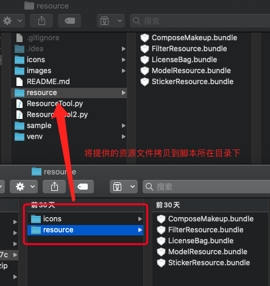
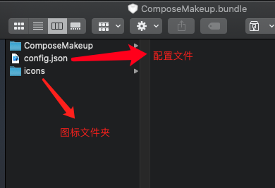
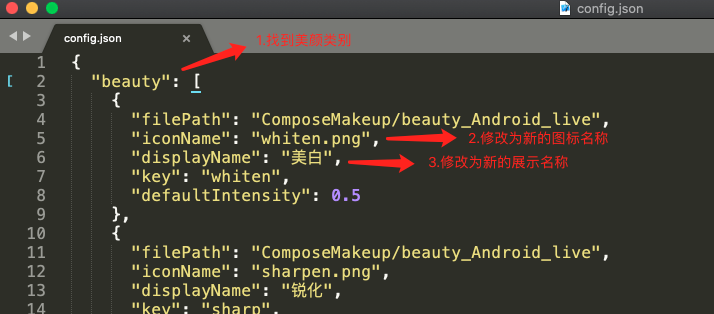
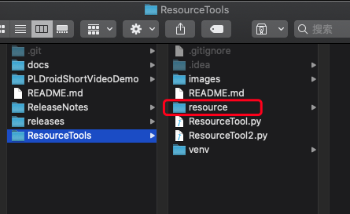

# 资源处理脚本使用指南
为了更为方便地在代码中加载和使用资源，需要对特效资源文件做一些处理，从而生成与之对应的 json 配置文件。您可以通过该脚本来快速方便地处理资源，并把处理过后的 resource 文件夹拷贝至您的工程中以便使用。具体使用方式请参考 demo 工程。

## 1. 环境
本目录下共提供了两个 Python 版本的脚本
  
 - Python 3.x 请使用 ResourceTool.py
 - Python 2.x 请使用 ResourceTool2.py
 
运行脚本会自动为您安装 [pypinyin](https://github.com/mozillazg/python-pinyin) 库，如若不成功请使用命令 `pip install pypinyin` 自行安装。

## 2. 使用
将提供的 resource 文件夹和 icons 文件夹(可通过购买动态贴纸获取，如果没有可忽略) 放到与该文件同级目录下



在该目录下根据您的 Python 版本和系统类型执行不同的命令，命令如下所示：  

| Python 版本 \ 系统     |  Android  |  iOS   |
| ------------------------------------ | --------   | -----------------  |
| **Python3.x** |  python ResourceTool.py Android | python ResourceTool.py iOS |
| **Python2.x** |  python ResourceTool2.py Android | python ResourceTool2.py iOS |

## 3. 修改特效初始强度（可选）
特效初始强度为 0.5，如果您不需要更改该默认值，则可忽略此步骤  
如果您希望修改特效初始强度，请编辑脚本文件中的初始强度变量，这部分代码在脚本文件的头部，具体可参考下方示例代码：

```python
# 下面的变量分别对应美颜、美型、美体、美妆、滤镜特效的初始强度
# 如果想要具体设置某一种特效的初始强度，请在构建完 json 后自行依照 demo 中 resource 文件夹修改
beauty_intensity = 0.5
reshape_intensity = 0.5
body_intensity = 0.5
makeup_intensity = 0.5
filter_intensity = 0.5
```

## 4. 问题
### 4.1 Python 安装
可前往 [python官网](https://www.python.org/) 下载安装包，一键安装并设置环境变量，具体可参考 [Python 环境搭建](https://www.runoob.com/python/python-install.html)。
	
### 4.2 pip 安装与升级
Python 2.7.9+ 或 Python 3.4+ 以上版本都自带 pip 工具,如果您没有此工具请前往 [pip官网](https://pypi.org/project/pip) 下载安装，具体可参考 [pip 安装教程](https://www.runoob.com/w3cnote/python-pip-install-usage.html)。  
如果您的 pip 版本过低导致无法安装，可使用 `python -m pip install --upgrade pip` 来进行升级

### 4.3 如何修改图标与特效名称？
运行配置脚本后会为您的资源配置一份基本的 icon 和特效名称，如果想要自定义可以在脚本处理之后修改 config.json 文件与 icons 文件夹。美颜、微整形、美妆、美体的配置文件在 ComposeMakeup.bundle 下，滤镜的配置文件在 FilterResource.bundle 下，动态贴纸的配置文件在 StickerResource.bundle 下。  
修改示例：  
假如我想要修改美颜中美白的 icon 和特效名称  
1.美颜特效在 ComposeMakeup.bundle 下，打开该文件并找到 config.json，找到 effectName 为“美白”的一项，修改其 effectName 的值为新特效名称，修改其 iconName 的值为新的图标文件名称。





2.将在上一步修改的图标名称所对应的文件拷贝到 icons 文件夹中

### 4.4 多 Python 版本问题
建议使用电脑上默认 Python 版本来运行脚本，原因为运行脚本会为您安装 pypinyin 库到默认 Python 版本中，如果使用非默认 Python 版本运行可能会出现找不到 pypinyin 库的情况，可自行指定 Python 版本安装 pypinyin 库解决此问题。

### 4.5 异常情况
如果出现找不到图标或者某些资源识别不了的情况，请按照脚本运行给出的提示自行修改，处理结果可参见 demo 中的 [resource](../PLDroidShortVideoDemo/app/src/main/assets/resource) 文件夹。  
如果您使用我们提供的脚本运行失败，则可以进行如下验证：  
1. 将 PLDroidShortVideoDemo 中 [resource](../PLDroidShortVideoDemo/app/src/main/assets/resource) 文件夹拷贝到 ResourceTools 目录，拷贝后目录结构如下：  
  
2. 运行脚本  
如果运行成功，说明不是脚本问题，是资源问题，请重新申请资源。  
如果运行不起来，可能是 python 环境问题，可参考前几个小节来修改。  
如果运行中出错，可以联系七牛技术支持提供帮助。
